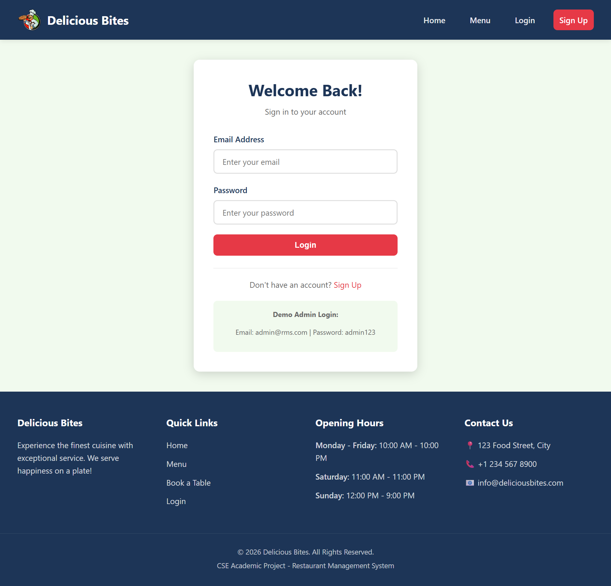
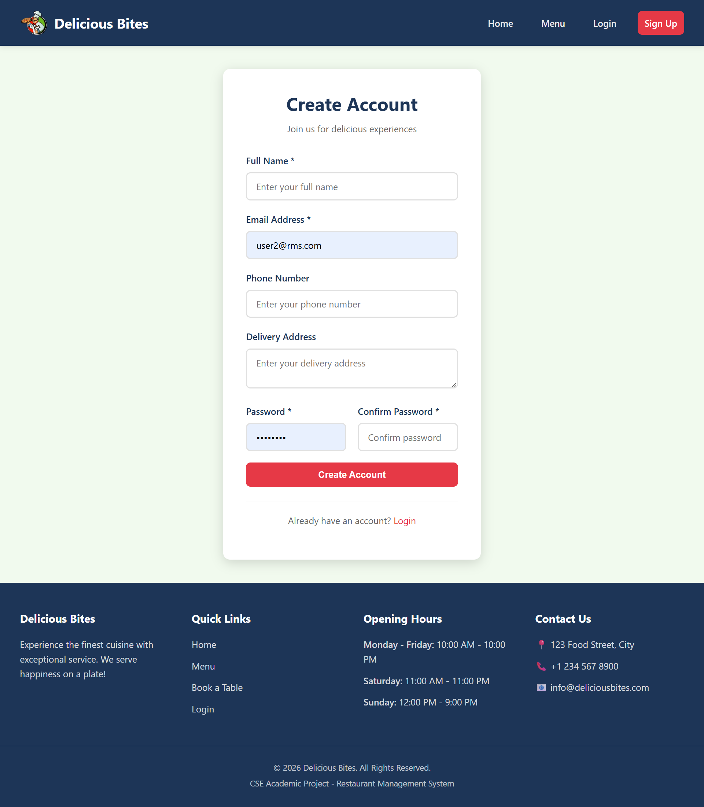
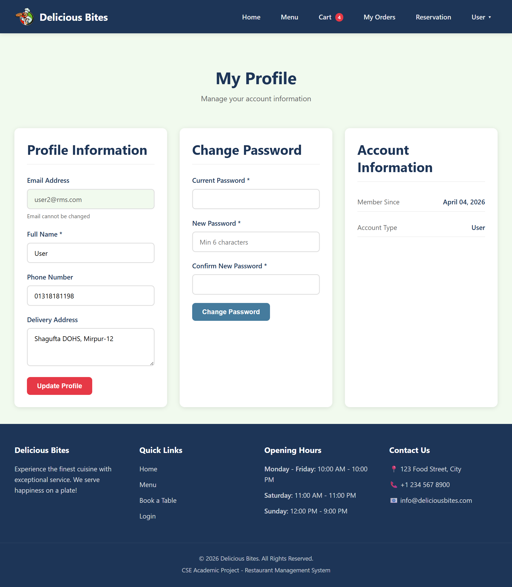
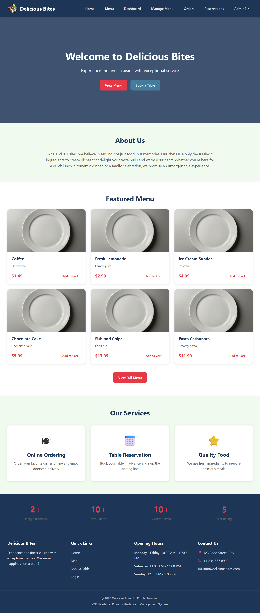
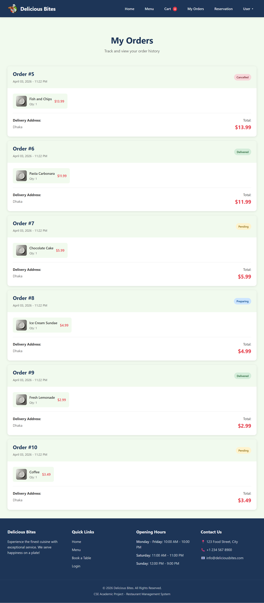
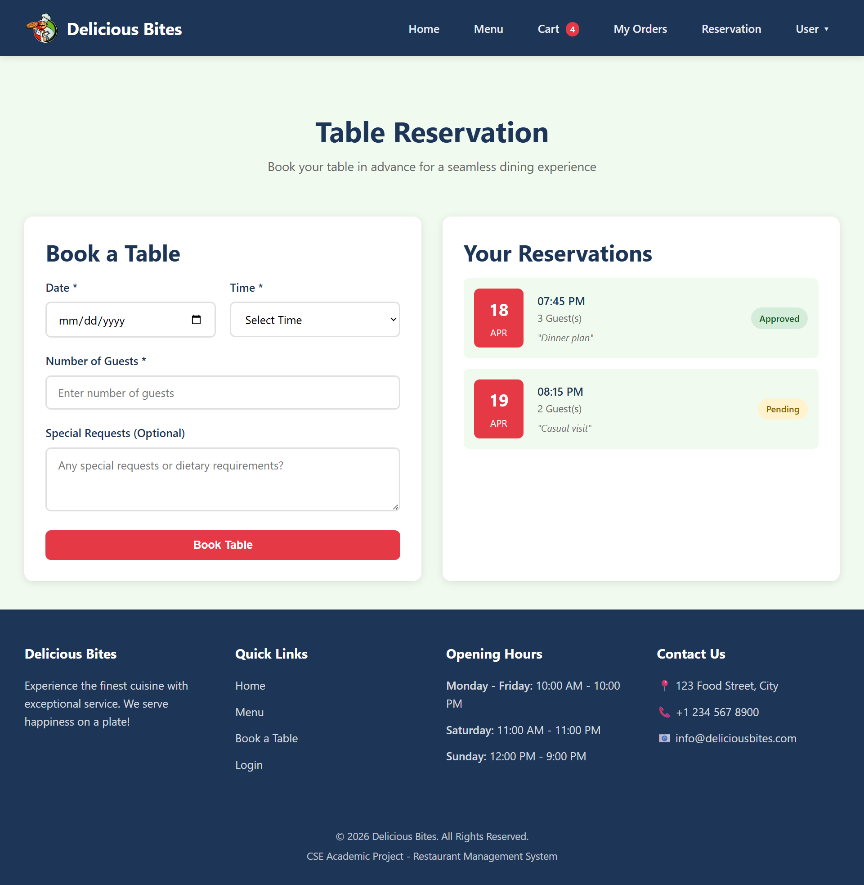
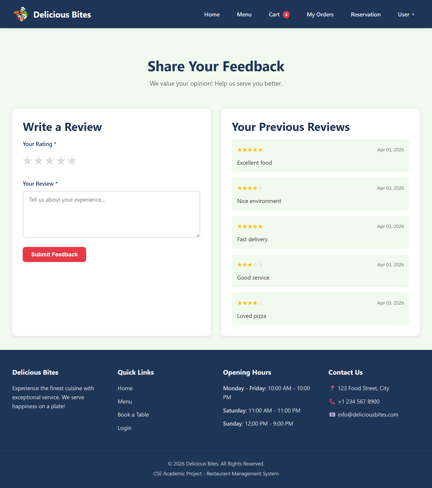
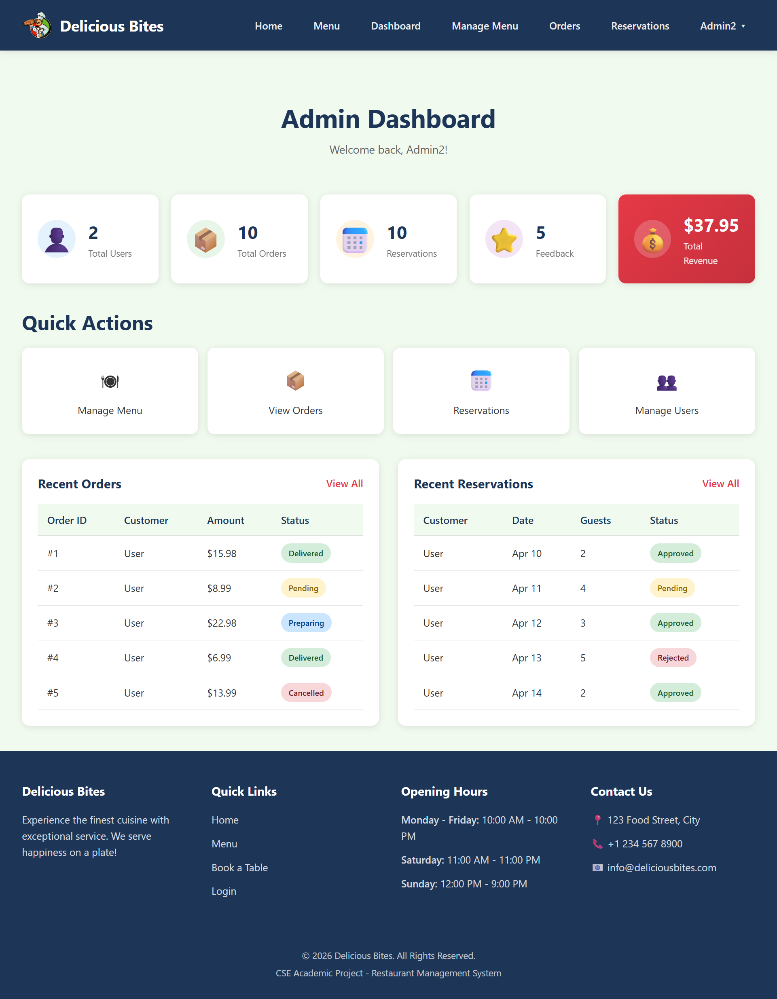
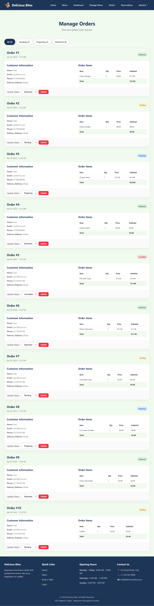
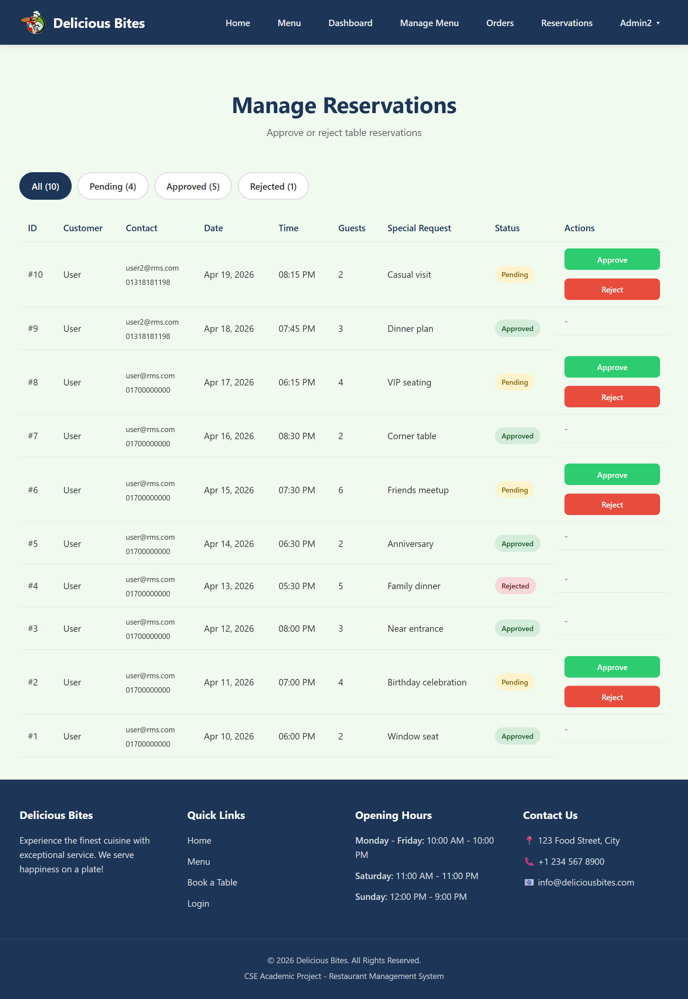

# 🍽️ Delicious Bites (RMS Website)
**Prepared by : SmartServe Team**

Delicious Bites is a web-based Restaurant Management System (RMS) built using Core PHP, MySQL, HTML, CSS, and JavaScript.

The system allows customers to browse menus, place orders, reserve tables, and submit feedback while administrators manage restaurant operations through a centralized dashboard.

---

## 📌 Project Overview

Restaurants often face difficulties managing orders, reservations, and customer feedback manually.

This system provides:

### 👤 Customer Panel

- Menu browsing
- Cart system
- Order placement
- Reservation booking
- Feedback submission

### 🛠️ Admin Panel

- Dashboard analytics
- Menu management
- Order control
- Reservation approval
- User management

---

## 🚀 Features

### 👤 User Features

- Registration & Login
- Browse menu items
- Search & filter menu
- Add items to cart
- Checkout system
- View order history
- Book table reservation
- Submit feedback & ratings
- Update profile
- Change password

### 🛠️ Admin Features

- Dashboard statistics
- Add / edit / delete menu items
- Upload menu images
- Manage orders
- Approve / reject reservations
- View customer feedback
- Manage users
- Toggle menu availability

---

## 🧱 Technology Stack

| Layer      | Technology              |
|------------|-------------------------|
| Frontend   | HTML5, CSS3, JavaScript |
| Backend    | Core PHP                |
| Database   | MySQL                  |
| Server     | XAMPP                  |
| Architecture | Session-based authentication |

---

## 📁 Project Structure

```
DeliciousBites/
│
├── admin/
│   ├── dashboard.php
│   ├── manage_menu.php
│   ├── manage_orders.php
│   ├── manage_reservations.php
│   ├── manage_users.php
│   └── feedback.php
│
├── user/
│   ├── profile.php
│   ├── my_orders.php
│   ├── reservation.php
│   └── feedback.php
│
├── auth/
│   ├── login.php
│   ├── register.php
│   └── logout.php
│
├── config/
│   └── database.php
│
├── includes/
│   ├── header.php
│   ├── footer.php
│   ├── navbar.php
│   └── functions.php
│
├── assets/
│   ├── css/
│   ├── js/
│   ├── images/
│   └── screenshots/
│
├── database/
│   └── rms.sql
│
├── index.php
└── README.md
```

---

## ⚙️ Installation Guide

Follow these steps to run the project locally:

### Step 1: Install XAMPP

Download and install XAMPP

Start:

- Apache
- MySQL

### Step 2: Clone Project

```bash
git clone https://github.com/yeasin-islam/DeliciousBites
```

OR download ZIP and extract inside:

```
C:\xampp\htdocs\
```

### Step 3: Create Database

Open:

```
http://localhost/phpmyadmin
```

Create database:

```
rms_db
```

Import file:

```
database/rms.sql
```

### Step 4: Run Project

Open browser:

```
http://localhost/DeliciousBites/
```

---

## 🔐 Default Admin Login
**Admin:**
- **Email:** admin@rms.com
- **Password:** admin123

**User:**
- **Email:** user@rms.com
- **Password:** user123

---

## 🗄️ Database Tables

- users
- menu_items
- orders
- order_details
- reservations
- feedback

---

## 🔄 System Workflow

### User Flow

Register → Login → Browse Menu → Add to Cart → Checkout → Order Stored

### Reservation Flow

Login → Book Table → Admin Approves → Reservation Confirmed

### Admin Flow

Login → Dashboard → Manage Menu → Manage Orders → Manage Users

---

#### 🔐 Login Page


#### 📝 Register Page


#### 📝 Profile Page


#### 🏠 Home Page


#### 🍽️ Menu Page


#### 🛒 Cart Page


#### 📦 Orders Page


#### 📅 Reservation Page


#### ⭐ Feedback Page


#### 📊 Admin Dashboard


#### 📋 Manage Menu


#### 📦 Manage Orders


#### 📅 Manage Reservations



---

## ⚠️ Limitations

- No online payment integration
- No real-time delivery tracking
- Limited UI customization
- No mobile application
- No inventory management module
- Basic security implementation
- Scalability constraints

---

## 🔮 Future Enhancements

- Online payment gateway integration
- Email notification system
- Delivery tracking system
- Inventory management module
- Sales analytics dashboard
- Mobile application version

---

## 👥 Team Contribution

**SmartServe Team (Group-3)**

| Team Member | Role | Contribution |
|------------|------|--------------|
| Md. Yeasin Islam (4284) | Full Stack Developer | Backend development, authentication system, admin dashboard logic, database integration |
| Ankon Saha (4295) | Frontend Developer | UI layout design, menu pages, reservation interface |
| Afsana Hamima Punam (4737) | Database Designer | Database schema design, table relationships |
| Hamira Begum (4733) | Documentation & Testing | Report writing, workflow testing, screenshots preparation |

---

## 👨‍💻 Author

**Md. Yeasin Islam** - Full Stack Web Developer

[LinkedIn](https://www.linkedin.com/in/yeasin-islam10/) || [Portfolio](https://yeasinislam08.web.app/)

